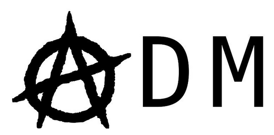

						

# *Anarchistic Decision Making*...

```python
blob = TextBlob(chomsky_on_anarchism_chapter_1, analyzer=NaiveBayesAnalyzer())
blob.sentiment

print(chomsky_on_anarchism_chapter_1[0:500])
```

Sentiment(classification='pos', p_pos=1.0, p_neg=1.949023440656887e-146)

 noAm ChOMsKy   2013  1  RATheR wroTe  ON   A     hENCe iNEvItAbly CONsIDErS  wRoTe      Has    LiKE    —InCLUDInG  NoTED  WHOsE  arE        couLd not HAve dONe bEttEr[1]  hAvE. BeeN     AnD   HAve been ReFERred     wOUld Be   TrY  eNcOmPAsS          Or  and evEN IF  proCEeD  Extract            danIEl guÉRIN DoEs.    REMAiNs   foRmULAte     . AND     And      RUdOLf rockeR  prEsEntS          TOWARds     BeaR   gUérin’S  PuTS   WElL when  WRITes   iS NoT       fIXeD selFeNcLOSeD .  buT                .     aNd   stRIveS     . .  eXpLOItIng      and     EveN  is    NOT    siNCe  TeNDS constAnTlY  bEcoME  ANd  aFFect           is NoT     BUT      eVerY    BrING        aND     hAS endoWeD  aND tuRn  .    LEsS      iS iNFlUeNceD   OR      ANd LESs FaTALLY grOw  WiLL   beComE   wIlL  BeCOMe             haS grOWN[2]   mIgHt aSk    Is  STUdyINg           doES NoT    AND    iNdeEd .  DiSMISs      Or OtHErwisE          mighT HOWEvEr. ARGue rATHER difFEreNTlY   EVeRy      mUsT bE  dIsmANTle     aND   SuRvIvE    when  migHt. HAVE BeEN jUStiFIeD        oR  or   bUT  NoW ContRibUTe —RATHER  alleViaTe— AnD   iF SO  wIlL Be      fIxeD    AnD  noR alSO BEttEr hEAr eVen NECeSSaRILy   and.      TOwarDs    SHOuLd teND suRELY        or        iS So    fArrEAcHing  muST BE TReATED    JuST   iS   wheN  hEaR    Or     Or      requireS  Or     aND    nEVeRThELess .     IS EverY   DEVeLOP inSOfAr .                         rocKER.    iS set   sImILArly FoRtH arE  is   frEeIng        aND  And   AnD   iS not   ANd     NOr stuLtiFying  BUt ratHer  ReConSTRUct          uP ANd BuiLd  uP           BUT     aRe FItTeD    Since  Are   VAlUeCrEatING          CaN ARIse thEirs mUST Be    freeing         haS fastENEd.    frEEING      ANd    . aND.  OPeNINg.           And  bAsEd    ANd             PrepARe  tOIlIng  alSO foRwarD sAiD   aND   aGo tUrN     AnD  biND  toGEtHEr     Is     AnARchOsyndicAliSm aNd      is  [P 108]     roCkeR wOuLD TaKe  grAntED          IS   uPOn          IS    And      InCLudING  .      [3]         ’  creaTE NOt    BuT ALSO             emBODy        —ANd  loOkS fORwarD      WILL dISmaNtle     weLL       PUt      Is    .     ARe. ConviNced      CAnNOt BE creATEd    AnD     BuT           AnD         is    OVEr      .         .    AnD    are        anD SySTematiCalLy carRy ON  and   

# *...with a little help from Gertrude Stein*

For my [NaNoGenMo 2021](https://github.com/NaNoGenMo/2021) commitment, i'm taking the original Text **"On Anarchism"** by Noam Chomsky from »[The Anachist Library](https://theanarchistlibrary.org/library/noam-chomsky-on-anarchism).

---

Today, many computational procedures for poetry analysis have implemented rules to bring poetry into "a strict form" < which means, to make out of the poetry, the more or less "free vocabulary" an "strict one". 

Therefore, some Computer Linguists like f.ex. [Barakhnin et. al.](https://www.researchgate.net/publication/337737440_Word_reordering_algorithm_for_poetry_analysis) try to equate poems to the syntax constructions of prose texts with the help of chunks and syntax groups (Noam Chomsky theory).

---

If we define a text as a combination of elements (characters, words,  lemma, interpunctuation, POS, n-gram, etc.), we can count these elements  < The construction of countable structures according to own  specifications, <writing your own rules for doing so> we are able to expand those syntax constructions and play with them as a new grammatical order:

*"A cool red rose and a pink cut pink, a collapse and a sold hole, a little less hot."* < **Gertrude Stein on NLP**

---

During her numerous attempts to recreate concrete objects through unconventional new names, Stein developed a form on her own < A very direct reference to the concrete world of things. She operated for this often on primarily the rhythmic-syntactic level, rather than on the meaning-giving semantic level. This involved mapping visual features of objects within the framework of individual sentence structures > and sometimes led to texts like that one: 

```
In working when she did what she did she worked all she worked and 
she did all she did when she did what she did. She did what she 
did and she worked. She felt what she felt and she did what she 
did and she worked. She did what she did and she felt what she felt 
when she was doing what she did and she worked when she did 
what she did and she did what she did when she worked. She felt 
what she felt when she did what she did when she worked. She 
worked when she did what she did. She felt what she felt when she 
did what she did. She worked when she did what she did and she 
felt what she felt when she worked, when she did what she did. < »Right, left, I had a good job and I left«
```

With such seemingly endless repetitions and imperceptible variations of a few words and sentences, Gertrude Stein intended to record a stream of consciousness that is intended to suggest to the reader the feeling of a "continued presence " and a "pure being", she said. Inspired by Cézanne's Impressionism, but especially by Picasso's Cubism, she no longer produced conventional stories with plots, but a prose in which she adopted the lessons of abstract painting in a literal sense. She had tried -just like her painter friends- to eschew representationalism and focus entirely on the plastic possibilities of language.

---

# My 50k novel - step by step

## Technical Desription

“Literal Untargeted Adversarial Black Box Attack”

## Steps

1. **Reading steins »Poetry & Grammar (1935)**
2. **interpret it and try to formalize it in creating simple grammatical rules**
3. Taking the message **"No Justice No Peace"** from **anonymous Anarchist agency**, who hacked the website of the German police agency in December 2019, see:[anarchistnews.org](https://anarchistnews.org/content/german-police-union-gdp-website-hacked-%E2%80%9Canonymous-anarchist-agency%E2%80%9D-aaa).
4. **POS-tag it** the *oulipotique* way, in Python with SpaCy
5. And manipulate the Text step by step:
   1. **prepositions** are usually wrong
   2. **articles** are delicate and varied items
   3. **adjectives** are not interesting
   4. **nouns** are not interesting
   5. **verbs** are in motion
   6. & **adverbs** moves with them
   7. **pronomia** are moving in a very large space of possibility
   8. **names** do not
   9. **upper and lower case spelling** is fun to play with 
   10. **question marks** are uninteresting
   11. **exclamation marks and inverted commas** are unnecessary and ugly
   12. **commas** are useless
   13. the **dot** leads the text to its own life
6. After each step < Analyse it with the opinion mining technique "sentiment analysis" (with TextBlob)

## Goal 

Try to trick the machine literary, so that the subjective information in an expression is inverted their classification. In short: Opinions, emotions or attitudes towards a topic or a person or whatever, which are usually interpreted by the machine as negative or bad will be "misinterpreted" as positive.

---

Like William S. Burroughs and Brion Gysin who created together step-by-step instructions to grammatically scramble the social structure of their time > thus deciphering the prevailing *syntax of control* > thus the preconditions of understanding < It is because the dominant language is the language of the dominant class, an undermining of a dominant-legitimate use of language must be formulated through the use of alternative language techniques.

Just like Gertrude Stein, they poetically appropriated and explored therefore the language technologies of their time.

# Gertrude Stein on NLP

Gertrude Stein was a writer who, in her  literature, experimentally discovered spaces in order to assemble the  fragmentary into poetic and prosa arrangements, to replace the outdated  systems of the 19th century, stepping towards a new understanding of  language. Parts of her works belongs to an early type of *combinatoric poetry*. Starting from *combinatoric prose*, we can see those plays with language especially in works  like »Tender Buttons«. She used formalised restrictions  and self given constraints to process language, filter it and transform  it mainly on a syntactical level into poetry.

In her thoughts about the craft of writing, Gertrude Stein wrote about writing as poietic action and she showed us that counting and writing poetry  have so much in common, and could not be without each other: without the calculation with words that we constantly do with and through these  systems. Well, Technology is a way of thinking and doing, she learned us and there are few among us who have distanced themselves from her or  have not at least mentioned her as a source of inspiration and a  teacher.

Modernist poetry discovered those cognitive systems and spaces at the beginning of the 20th century. The syntax of our formal technical languages thus entered a new  millennium hand in hand with early poetic language techniques and  experiments.

## Today

Well, today the times they are a changin' - but some things still remains the same.

In the 21st century we have seen that as soon as social subjects and social movements aim for political visibility, they become inscribed in  opaque layers of new technologies, whether they intend to do so or not.  But this does not necessarily mean submitting to their laws! 

It is possible – if one knows which rules to break, and how to break them, without bringing down the  overall set of rules – to destabilize those spaces of action.

---

### ...to scramble the prevailing *syntax of control*

So I'm following the oulipotique way of writing, i just described above, in my *Adversarial Prose*.

So I'm inventing with my Adversarial Prose, writing rules <step by step> based on Gertrude Steins literary journey from prose to poetry to grammatically scramble the *syntax of control*.

A syntax which is implemented in new technologies, in repressive instruments of domination > in language models which preventively limit the political power of emancipatory movements, not only in the virtual world, but also on the streets, up to the point of the absolute political inability to move. 

So let's try to write in rhythm, like the Beatniks < *those who write in rhythm*. Those who wrote like they walked > and they walked like they wrote > and they was in search of the rhythm of the city > and the rhythm of the machine > and just like Gertrude Stein > they poetically appropriated and explored therefore | the language technologies of their time.

Luckily, those instruments of domination always require a formal framework, a collection of a priori knowledge about the language and the social context of our time.

Let's see if we can trick them...

​				...with a little help from Gertrude Stein:

## Steinese tokenization

Gertrude Stein wrote in her Essay »Poetry & Grammar« in 1935: “*I like the feeling the everlasting feeling of sentences as they diagram themselves*.” 

In this literary journey from prose to poetry, she was *“trying to understand (…) to feel inside the words that come out to be outside of you*” and she tried that experiment in using an approach to diagram  sentences. So she began to enumerate all those words who do something,  because in her eyes, *“as long as anything does something, it stays alive”*. She was doing something closed to what we name nowadays in Computerlinguistics the process of *POS-Tagging*:

```
('they', 'PRP'),
 ('see', 'VBP'),
 ('that', 'IN'),
 ('darker', 'NN'),
 ('makes', 'VBZ'),
 ('it', 'PRP'),
 ('be', 'VB'),
 ('a', 'DT'),
 ('color', 'NN'),
 ('white', 'JJ'),
 ('for', 'IN'),
 ('me', 'PRP'),
```

A grammatical classification. But Stein does it not in a general but in her own way. Like i have said before: she was always  writing her own rules, settling down her own constraints.

She started in »Poetry & Grammar« with writing about the *prepositions*, which are usually wrong. Then she came to the *articles*, which are delicate and varied items. To use them, can be a varied and living pleasure, “*they are just as interesting as nouns and adjectives are not.*” The *adjectives* are not interesting for her, for the simple reason that they “*are the first thing(s) to take the very thing(s) out of the written word of anyone*”. And why *nouns* are not interesting? …The search for especially this answer will be her long journey from prose to poetry.

Then, she was coming to *verbs* and *averbes* “*they can and should constantly make mistakes*”: Verbs can change, they can “*change themselves to look like themselves (…) they are in motion*”, and adverbs move with them. *Pronomia*, in contrast to *names*, are moving in a much larger space of possibility, first, because they  cannot go hand in hand by adjectives and second because they are not  really the name of anything.

Finally, Gertrude Stein comes to *punctations*. To *capitalization*, which is fun to play with, and to “*uninteresting question marks*” and to *exclamation marks* and *quotation marks*, which she finds “*unnecessary*” and “*ugly*” because they “*destroy the image of what is written*”. To *spaces* such as *dashes* and *dots* and to possessive *apostrophes* that give many a genitive “*fine delicate undertone*”.

To play with the *upper and lower case* spelling is a lot of fun. *Question marks* are uninteresting. *Exclamation marks* and *inverted commas*, she finds “*unnecessary*” and “*ugly*” because these *“destroy the image of the Writing”*. And the use of *commas* is kind of useless to Stein, because in their own way they replace  one’s own interest. They make things easier but not really easier, they  are a kind of “*poor dots*”. Commas are servile and submissive. For her, quite the opposite of dots.

But the *dot*, the “*real dot*” is essential for Stein. Especially when it comes to poetry: she does not describe with any word more beautifully what it is like when a written work, when her produced work begins to lead its own life than with the *dot*. The dot begins to act independently: when he force you “*again and again sometimes to stop*”, simply because you have to stop physically from time to time. The dot could “*come to exist*” in its own way. Dots have their “*own necessity, their own feeling and their own time.*” “*And that feeling, that life, that need, that time, can express itself in an infinite variety.*”

Finally Gertrude Stein comes to the *sentences* which are formed by using the previous one, and to paragraphs. She is writing about her *trials & errors* by bringing together the non-emotional balance of a sentence, with the  emotional balance of the paragraphs, when she tried to make *One* out of it.

# NLP on Anarchism...:

Chapter by Chapter

The Code:

The Outputs:

Run on Binder:
